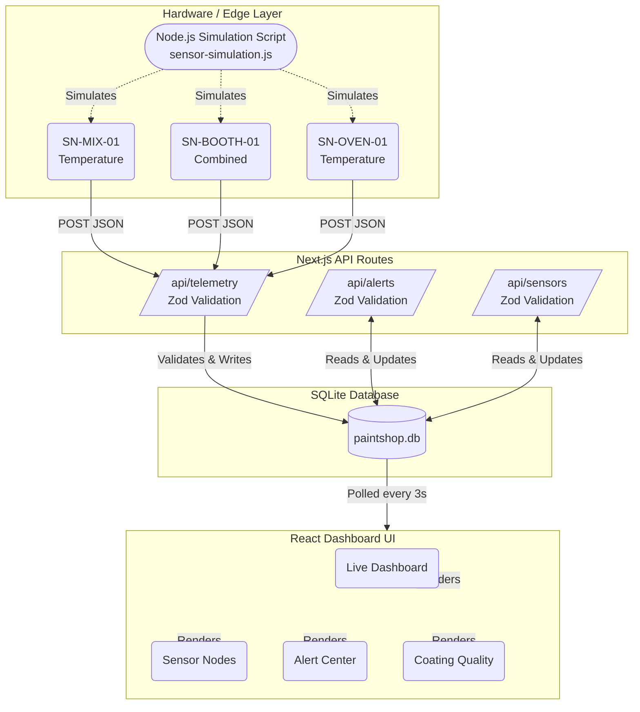

# PaintShop Industrial Telemetry & Quality Dashboard

An enterprise-grade, real-time telemetry and quality dashboard designed for industrial paint shops. This system ingests live sensor data (temperature and humidity), correlates it with coating defects, tracks system alerts, and calculates an ongoing Coating Quality Index (CQI).

## 🚀 Key Features

*   **Real-time Dashboard**: Live gauges, telemetry charts, and CQI scoring using auto-polling to ensure sub-second UI updates without manual refresh.
*   **App Shell Architecture**: Built with a highly professional Sidebar and TopNav layout, fully responsive and utilizing a modern "Zinc" color palette.
*   **Dark & Light Mode Support**: Integrated via `next-themes` for seamless toggling based on user preference or system settings.
*   **Backend Validation**: API routes are heavily protected with strict type checking and data coercion using **Zod**, preventing invalid data from reaching the SQLite database.
*   **Hardware Simulation Ready**: Includes a Node.js script to simulate hardware API interactions, perfect for live demonstrations or testing.

## 📐 System Workflow & Architecture

The application is structured around a Next.js App Router full-stack architecture. Telemetry nodes push data to the API, which validates and stores it in SQLite. The front-end dashboard polls for these changes dynamically.



### How Data Flows (Workflow Explanation)

1.  **Ingestion**: Physical sensors (or our `sensor-simulation.js` script) generate JSON payload data containing timestamps, sensor IDs, temperatures, and relative humidity. They transmit this via `POST` requests to `/api/telemetry`.
2.  **Validation**: The Next.js API intercepts the payload. **Zod** schemas rigorously check the data types (coercing strings to numbers if necessary) and validate thresholds.
3.  **Processing & Storage**: The telemetry service checks the payload against configurable thresholds (e.g., Temperature > 35°C). If an anomaly is detected, it automatically generates a new Alert record. Everything is committed to the local `SQLite` database.
4.  **Real-Time Rendering**: The React frontend utilizes a global polling mechanism (`setInterval` triggering `fetchData` every 3 seconds). As new telemetry and alerts hit the database, the frontend state updates instantly, trickling down into the Recharts components, Live Gauges, and Alert tables.

## 🛠️ Tech Stack

*   **Framework**: Next.js 15 (App Router)
*   **Styling**: Tailwind CSS & `shadcn/ui` primitives
*   **Validation**: Zod
*   **Database**: `better-sqlite3`
*   **Icons**: Lucide React
*   **Charts**: Recharts

## 💻 Getting Started

### 1. Install Dependencies
```bash
npm install
```

### 2. Run the Dashboard
Start the Next.js development server:
```bash
npm run dev
```
Navigate to `http://localhost:3000` to view the application.

### 3. Run the Hardware Simulator (Real-time Demo)
To make the dashboard come alive with real-time data, open a **separate terminal window** and run the simulation script. This script will begin firing telemetry data and random anomalies at the API.
```bash
node scripts/sensor-simulation.js
```
*Sit back and watch the Live Gauges move and the Alert Center catch anomalies!*

## 📁 Key File Structure

- `src/app/api/`: Backend Next.js routes (telemetry, alerts, sensors, config).
- `src/components/`: Reusable React components (`shadcn/ui` and custom domain components).
- `src/lib/`: Database initialization (`db.ts`), business logic services, and TypeScript types.
- `scripts/`: Contains the `sensor-simulation.js` hardware mock.
- `data/`: The SQLite database files are stored here.
